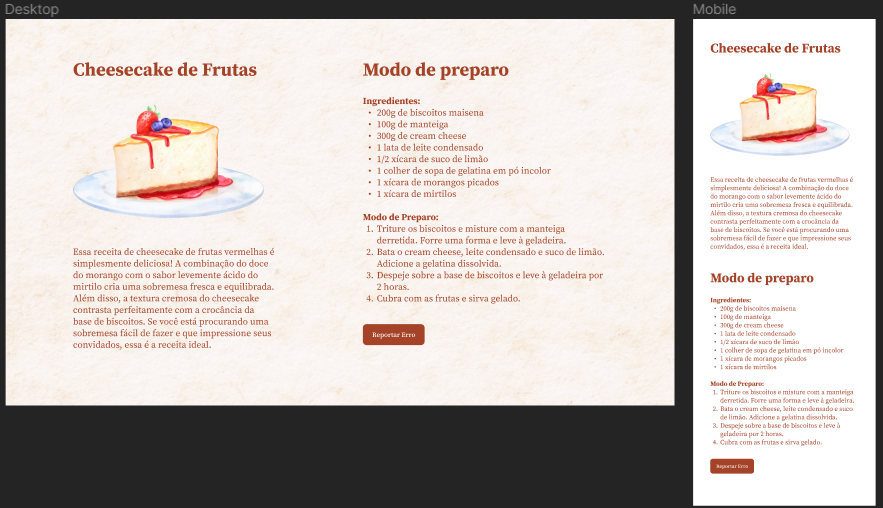

<h1 align="center"> Cheesecake </h1>

Projeto promovido pela Rocketseat na trilha Explorer para ensino de tecnologias WEB à respeito de responsividade, considerando layouts mobile.

  <a href="#-tecnologias">Tecnologias</a>&nbsp;&nbsp;&nbsp;|&nbsp;&nbsp;&nbsp;
  <a href="#-projeto">Projeto</a>&nbsp;&nbsp;&nbsp;|&nbsp;&nbsp;&nbsp;
  <a href="#-layout">Layout</a>&nbsp;&nbsp;&nbsp;|&nbsp;&nbsp;&nbsp;
  <a href="#memo-licença">Licença</a>

  

 

## 🚀 Tecnologias

Esse projeto foi desenvolvido com as seguintes tecnologias:

- HTML e CSS
- Git e Github
- Figma

## 💻 Projeto

Cheesecake é um projeto WEB para fins de estudo de responsividade em aplicações WEB, considerando também layouts mobile.

## 🔖 Layout

Você pode visualizar o layout do projeto através [DESSE LINK](<https://www.figma.com/file/YSu59SrvjEvSfb1HMIZ3kH/Cheesecake-%E2%80%A2-Projeto-Explorer-(Community)?node-id=0%3A1&mode=dev>). É necessário ter conta no [Figma](https://figma.com) para acessá-lo.

## 📝: Licença

Esse projeto está sob a licença MIT.

---

Feito com ♥ by Rocketseat :wave: [Participe da nossa comunidade!](https://discord.gg/rocketseat)
